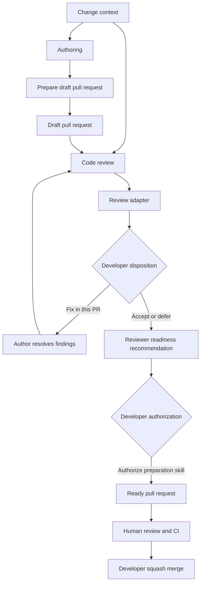

# Agentic Development Workflow

## System Overview

This workflow helps an individual developer use a complementary author-reviewer agent pair to implement and independently review one cohesive change at a time while remaining compatible with ordinary human team practices. It carries explicit intent from planning through a draft GitHub pull request, uses private local review and fix iterations when appropriate, and hands a concise, evidence-backed pull request to human reviewers before the developer merges it.

The workflow defines responsibilities, artifacts, and human decision points rather than orchestrating agents itself. The developer manually coordinates a persistent author agent and a separate persistent reviewer agent in the initial design; automation may be added later without changing these core contracts.

The workflow is not delivered as one comprehensive skill. Agents receive only the control layer relevant to their current work: repository instructions, the current change brief, and a task-specific skill when pull-request preparation, formal review, or finding resolution is explicitly requested. The human-facing transitions are defined in [`05-human-workflow.md`](./05-human-workflow.md).

## Objectives and Guiding Principles

- **Human authority:** The developer owns intent, scope, judgment calls, publication, and merge decisions.
- **Explicit intent:** Each change begins with enough durable context to distinguish required behavior from implementation preference.
- **Cohesive scope:** Work advances one feature, bug fix, or similarly focused change at a time.
- **Independent review:** A reviewer separate from the author evaluates the complete changeset without inheriting the author's rationale as assumed truth.
- **Agent continuity:** The same author and reviewer normally remain active throughout the private loop so repository discovery, design context, and review history are reused.
- **Proportional rigor:** Review depth and verification effort reflect the change's actual risk and complexity.
- **Controlled repair:** The author receives only findings approved for the current pull request and does not absorb tangential cleanup.
- **Evidence over confidence:** Review readiness rests on inspectable code, verification results, and documented risk rather than agent assurance.
- **Team-compatible output:** Local agent activity culminates in a concise GitHub pull request that follows ordinary human collaboration practices.
- **Recoverable context:** Durable artifacts allow another agent or the developer to resume work after interrupted sessions.
- **Replaceable tooling:** Workflow contracts remain independent of a particular agent, terminal manager, review interface, build system, or company policy.

## End-to-End Manual Workflow

1. **Define the change.** The developer and author establish the goal, acceptance criteria, constraints, and appropriate planning depth using the artifacts defined in [`10-change-context.md`](./10-change-context.md).
2. **Implement one cohesive change.** The author modifies the code within the agreed scope and gathers proportionate verification evidence as defined in [`20-authoring.md`](./20-authoring.md).
3. **Create a draft pull request.** The author invokes [`55-preparing-pull-requests.md`](./55-preparing-pull-requests.md) to publish the branch and record a structured handoff in a draft GitHub pull request without requesting final team review. Pull-request states and content are defined in [`50-pull-request-lifecycle.md`](./50-pull-request-lifecycle.md).
4. **Review the complete changeset.** A reviewer agent separate from the author evaluates the full branch delta against its stated intent and repository context using [`30-reviewing-code.md`](./30-reviewing-code.md).
5. **Deliver findings through the appropriate channel.** Privately authored changes normally use Hunk for local iteration; reviews of another developer's pull request may be prepared for GitHub publication. Delivery contracts are defined in [`60-review-adapters.md`](./60-review-adapters.md).
6. **Select and resolve in-scope findings.** The developer decides which findings belong in the current pull request. The original author receives only that selected set and follows [`40-resolving-findings.md`](./40-resolving-findings.md).
7. **Rereview after modification.** The same reviewer examines the complete updated changeset rather than checking only the previous findings. Steps 5–7 repeat while material in-scope issues remain and further iteration is justified.
8. **Finalize the pull request.** The reviewer presents a readiness recommendation containing the implemented behavior, risk, verification evidence, limitations, deferred findings, and useful reviewer guidance. After the developer authorizes finalization, the reviewer invokes the pull-request preparation skill to update reviewer-owned context without changing intent and marks the pull request ready for review.
9. **Use normal team review.** The developer and teammates review the ready pull request while GitHub policies and CI provide shared enforcement.
10. **Merge deliberately.** The developer performs the squash merge through GitHub after required reviews and checks pass. Merge execution remains outside this workflow.

## Roles and Authority

Roles describe responsibilities, while the normal runtime model keeps one author agent and one separate reviewer agent active for the life of the private review loop. Either may be replaced when necessary, but review independence and authorization boundaries must remain intact.

- **Developer:** Owns intent, scope, finding disposition, external publication, readiness authorization, and merge decisions. The developer may delegate execution but not accountability.
- **Author:** Implements the agreed change, gathers verification evidence, creates the draft pull request, and resumes implementation for findings selected by the developer. The same author normally remains active through the private loop so it can apply feedback with the original design and repository context. The author may not self-review, expand scope, publish findings, or decide readiness.
- **Reviewer:** Independently evaluates the complete changeset, produces structured findings and risk assessment, and remains the reviewer across iterations. It performs a full review after fixes rather than relying on memory of the previous delta. Following a successful final review, the reviewer recommends readiness and may update and mark the pull request ready only after developer authorization.

When reviewing another developer's pull request, the reviewer may publish an authorized GitHub review but does not take ownership of that pull request's description or readiness state.

## Control and Context Layers

Agent behavior is controlled through four deliberately separate layers:

1. **Repository instructions** provide always-on project rules, build conventions, and architectural constraints.
2. **Change context** provides the goal, acceptance criteria, scope, and current evidence for one changeset.
3. **Task-specific skills** provide specialized procedures only when the developer explicitly requests pull-request preparation, formal review, or resolution of selected findings.
4. **Handoff artifacts** carry durable state between agents through the branch, draft pull request, Hunk findings, and recorded verification evidence.

The workflow documents define these contracts for humans and future implementers. They are not intended to be loaded wholesale into every agent conversation.

## Workflow Areas and Planned Implementations

Each workflow area has one authoritative document, but only three areas initially require custom skills.

| Workflow area | Runtime form | Responsibility | Authoritative document |
| --- | --- | --- | --- |
| Human operation | Natural-language playbook with optional prompt aliases | Establish roles and explicitly initiate each workflow transition. | [`05-human-workflow.md`](./05-human-workflow.md) |
| Change context | Template and durable artifact | Preserve intent and supply the context required across authoring, review, and recovery. | [`10-change-context.md`](./10-change-context.md) |
| Authoring | Ordinary agent behavior guided by repository instructions, the brief, and this workflow contract | Implement and verify one cohesive change, then create the draft pull request and hand off. | [`20-authoring.md`](./20-authoring.md) |
| Pull-request preparation | Explicitly invoked skill used by author and reviewer | Create the structured draft, preserve intent authority, and apply authorized finalization. | [`55-preparing-pull-requests.md`](./55-preparing-pull-requests.md) |
| Code review | Explicitly invoked skill | Independently assess the complete changeset and produce structured findings, risk, and readiness recommendations. | [`30-reviewing-code.md`](./30-reviewing-code.md) |
| Finding resolution | Explicitly invoked skill loaded by the author | Resolve only selected findings, verify fixes, and return the complete changeset to the same reviewer. | [`40-resolving-findings.md`](./40-resolving-findings.md) |
| Pull-request lifecycle | Human-controlled playbook and explicit role actions | Maintain the durable team-facing record from draft creation through ready-for-review and human merge. | [`50-pull-request-lifecycle.md`](./50-pull-request-lifecycle.md) |
| Review adapters | Integration guidance using existing tools | Deliver review findings through Hunk or GitHub without owning review judgment or fix policy. | [`60-review-adapters.md`](./60-review-adapters.md) |

Confirmed decisions and unresolved design questions are tracked separately in [`90-decisions-and-open-questions.md`](./90-decisions-and-open-questions.md).

## Information Flow Between Workflow Areas

The workflow passes explicit artifacts between roles so that no handoff depends on a previous agent's hidden conversation state. The developer establishes each role and initiates transitions with explicit requests; the task-specific skill supplies procedure rather than intent.

The change context remains the source of stated intent, while the pull request becomes the durable team-facing record. Review findings move through an adapter without changing their meaning, and only findings selected by the developer return to the author. Agent conversations accelerate the loop but do not replace these durable handoffs.

## Human Checkpoints

Human control is concentrated at decisions involving intent, scope, external communication, or irreversible outcomes. Work inside an approved boundary may continue without repeated confirmation.

- **Authorize the change:** Confirm the change brief and the amount of implementation autonomy before authoring begins.
- **Resolve intent or scope changes:** Decide when new information would alter product behavior, public contracts, architecture, compatibility, or the agreed pull-request boundary.
- **Dispose review findings:** Select which findings must be fixed now, which are accepted, and which are candidates for later work. Standing authorization may cover clearly safe, local, behavior-preserving fixes defined by [`40-resolving-findings.md`](./40-resolving-findings.md).
- **Authorize publication:** Approve posting a review to another developer's GitHub pull request and approve the final reviewer update to a privately authored pull request.
- **Authorize readiness:** Decide whether the reviewer's readiness recommendation is sufficient to mark the pull request ready for team review.
- **Merge through GitHub:** Perform the final merge after human review, CI, and repository policy requirements are satisfied.

Implementation, local verification, review execution, and approved low-risk fixes are delegable activities. Delegation never permits an agent to silently broaden scope or convert a judgment call into an implementation decision.

## System Boundaries and Non-Goals

The workflow operates on a developer-controlled Git checkout and uses GitHub pull requests as its durable collaboration boundary. It may use local agents, Hunk, Herdr, native builds, Docker, and repository-specific verification commands, but none of those implementations define the workflow contract. GitHub CI, branch protections, and team review remain the shared enforcement layer.

The workflow must accommodate repositories with C++, long-running builds, worktrees, submodules, and meta-repositories without assuming that every checkout or verification environment is cheap to reproduce. Detailed documents define specialized behavior only where those constraints affect their contracts.

The workflow does not:

- orchestrate agents, allocate worktrees, or manage parallel execution;
- merge pull requests or bypass GitHub policy;
- replace repository CI, required reviews, or company governance;
- encode assumptions specific to one company, agent provider, or build system;
- autonomously advance into another feature or pull request;
- treat every review observation as authorized work;
- require transient implementation plans to become permanent product documentation;
- use the GitHub review timeline as scratch space for private agent iteration;
- require one monolithic workflow skill or a separate skill for every role;
- inject all workflow documentation into every agent's working context; or
- require slash commands or rely on agents to infer workflow transitions without an explicit user request.
